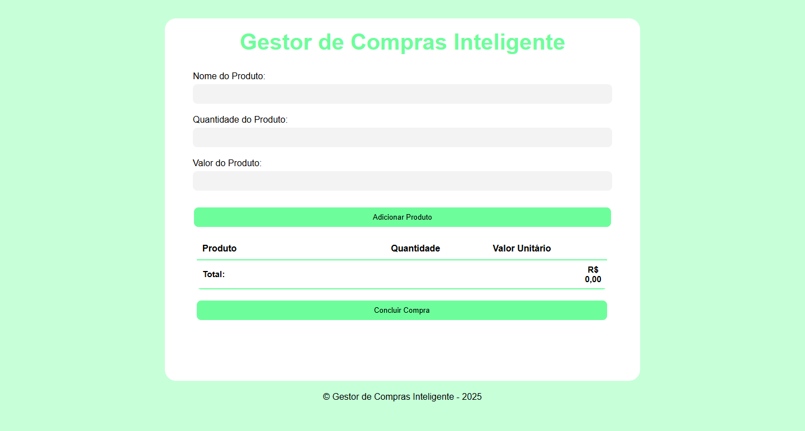

# 💼 Smart Purchasing Manager


O Smart Purchasing Manager é um sistema inteligente de gerenciamento de compras, desenvolvido para otimizar o processo de aquisição de produtos que serve como um self-checkout.

O projeto foi criado para treinar e revisar conceitos básicos de JavaScript como: Elementos Básicos, Condicionais, Estruturas de Repetição, Função e Local Storage.

## 📸 Demonstração



---

## 🚀 Tecnologias Utilizadas

<p align="left">
  
  
  
  
 
</p>

## 🧠 Funcionalidades

* ✅ Cadastro e listagem de produtos
* ✅ Simulação de orçamento inteligente
* ✅ Interface simples e responsiva
* ✅ Armazenamento local

## 📦 Estrutura do Projeto
```
├── index.html
├── style.css
├── script.js
└── README.md
```
## 🌐 Como Executar e Acessar

Como este é um projeto front-end estático, você pode executá-lo de duas formas:

1.  **Acessando o link (GitHub Pages):**
    * O site está disponível via **GitHub Pages**:
    * 🔗 **[https://lanacode.github.io/smart-purchasing-manager/](https://lanacode.github.io/smart-purchasing-manager/)**

2.  **Executando Localmente:**
    * Clone este repositório: `git clone https://github.com/lanacode/smart-purchasing-manager.git`
    * Navegue até a pasta do projeto.
    * Abra o arquivo `index.html` no seu navegador.

---

### 👤 Autor

Feito por **[Seu Nome]**.

* GitHub: [lanacode](https://github.com/lanacode)
* LinkedIn: `[SEU_LINKEDIN]`
